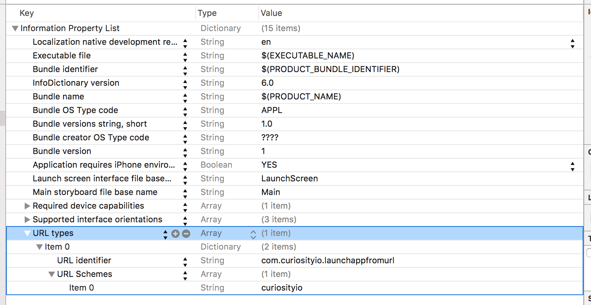

# LaunchAppFromURL-iOS
When someone clicks on a URL, you want your app to open and not the browser. This is how you do it on iOS. 

*Note: Info obtained from [this blog post](http://www.idev101.com/code/Objective-C/custom_url_schemes.html). There are also the [official docs from Apple](https://developer.apple.com/library/ios/documentation/iPhone/Conceptual/iPhoneOSProgrammingGuide/Inter-AppCommunication/Inter-AppCommunication.html#//apple_ref/doc/uid/TP40007072-CH6-SW1). 

Some background info on iOS. On Android, when a user opens up a link to your website such as http://curiosityio.com/about?foo=bar your app can open. With iOS, this is not the case. You must use custom schemes in iOS to launch your app such as: curiosityio://about?foo=bar (notice how this custom scheme is equivalent to the http link above. You can still make your custom scheme include fancy queries).

Now, you might be wondering "Why does the YouTube app open when I open a YouTube link on my iPhone?" YouTube is a special exception. Apple will open up the app store, sms, youtube for http/https links. You can view the [full list](https://developer.apple.com/library/ios/featuredarticles/iPhoneURLScheme_Reference/Introduction/Introduction.html#//apple_ref/doc/uid/TP40007899) of schemes that Apple has created specifically to open. Your app is not on this list so you must use custom schemes.

So if you want your app to launch instead of a website, you cannot. Either your website launches using http://,https:// *or* your app launches with yourscheme://. So if you want for example to launch your app from an email on your phone this is the recommendation. Have the email link to a web page on your website (so use http://, https//). Do this because if your user clicks on a link with a custom scheme and an app is not available for that, your phone browser opens and displays an dull message about how it cannot find the page or whatever. Not ideal for UI/UX reasons. Anyway, launch your web page. Then inside of your web page have a button that says tells user to "Open App" or something where the button is <a href="customscheme://whatever?foo=bar">Open App</a> launching your app and then also link to the app store link if they don't have it installed.

You can also use [Smart App Banners](https://developer.apple.com/library/ios/documentation/AppleApplications/Reference/SafariWebContent/PromotingAppswithAppBanners/PromotingAppswithAppBanners.html) in your app with one line of code:
`<meta name="apple-itunes-app" content="app-id=myAppStoreID, affiliate-data=myAffiliateData, app-argument=myURL">
` to show a button on the top of your web page asking them to launch your app or install it. This is a built-in iOS thing. 

How to get it working:  

* Info.plist
The Info.plist file is the only file you need to use to associate your app with a custom scheme.

Below can get a little confusing. If you would rather, there is an image in this project directory 
Open the Info.plist file in your project, then add a new row to the file (in XCode 7, you right click on the file and click "Add row"). When you add a new row, enter "URL types" (XCode will do an autocomplete for you to fill it in). Now, click the drop down arrow on the left hand side of URL types. This will show the "Item 0" row. Right click on "Item 0" and "Add row". Now again click the drop down arrow on the left of "Item 0" to show the child row of it. Name this row, "URL identifier" (XCode will autocomplete it for you). Then in the value field enter something unique here. com.yourdomain.yourappname is the best idea here. Right click again on "Item 0" then "Add row" to add another child row to it (you should have 2 children rows under Item 0 now) and name this row "URL Schemes" (XCode should autocorrect). Right click on this new row and "Add row" to make a child row of this "URL Schemes" row. "Item 0" is created. Set the value of this row to be your custom scheme. In my case, I choose "curiosityio" so I can use: curioistyio://blahblahblah.

* Really, you are done. Next is where we will discuss how to read this custom scheme when your app is launched and also how to test your connection. 

Your application is launched when someone clicks on a link with your custom scheme. Add this function to your AppDelegate file:  
```
    func application(application: UIApplication, handleOpenURL url: NSURL) -> Bool {
        // here is where you pick apart the url parameter to figure out the link that user clicked on to get here. 
        
        NSLog("url recieved: %@", url);
        if let query = url.query {
            NSLog("query string: %@", query);
        }
        if let host = url.host {
            NSLog("host: %@", host);
        }
        if let path = url.path {
            NSLog("url path: %@", path);
        }
        
        return true
    }
```

This function is called when someone clicks a link with your custom scheme. As you can see in here, I am pulling apart the host, query, path from the custom scheme URL. you can use the NSURL variable in the function as any other NSURL to pull apart the url the user clicked on.

Now comes testing to make sure it all works. You can create a button in your app and then create this action to run your custom scheme URL.
```
    @IBAction func buttonPressed(sender: UIButton) {
        UIApplication.sharedApplication().openURL(NSURL(string: "curiosityio://test?foo=bar")!)
    }
```
When this function is executed, you should see in your debug log some messages because of the NSLog() statements we put in the AppDelegate file. 
